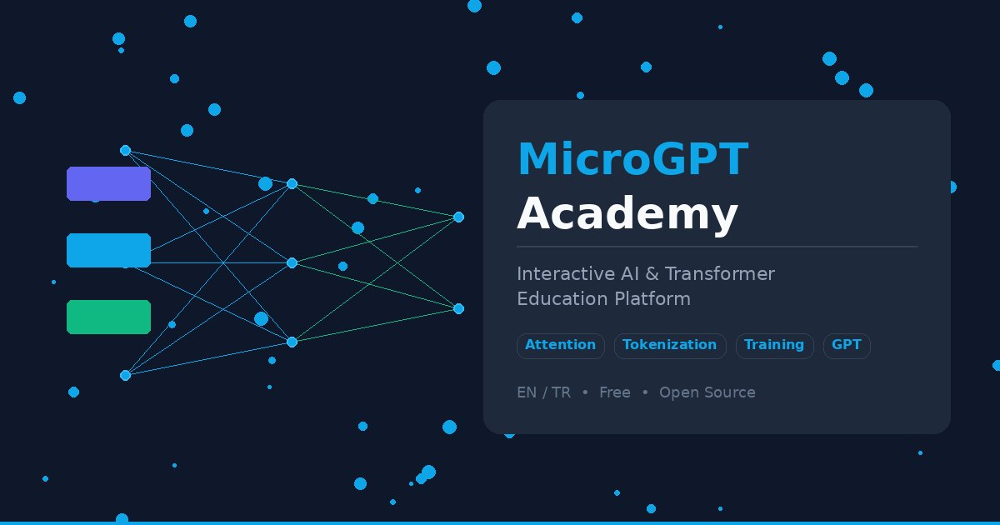

<p align="center">
  
</p>

<h1 align="center">🧠 MicroGPT Academy</h1>

<p align="center">
  <strong>Interactive GPT/Transformer Education Platform</strong><br/>
  <em>İnteraktif GPT/Transformer Eğitim Platformu</em>
</p>

<p align="center">
  <a href="https://microgpt-academy.vercel.app"></a>
</p>

<p align="center">
  <a href="https://reactjs.org/"></a>
  <a href="/LICENSE"></a>
  <a href="https://github.com/alicetinkaya76/microgpt-academy/pulls"></a>
  <a href="https://gist.github.com/karpathy/8627fe009c40f57531cb18360106ce95"></a>
</p>

<p align="center">
  <a href="#-türkçe">🇹🇷 Türkçe</a> · <a href="#-english">🇬🇧 English</a> · <a href="https://microgpt-academy.vercel.app">🚀 Live Demo</a> · <a href="https://colab.research.google.com/drive/1nTx2S54MeRMOPPOE1VUz4bdjAzERaVqC">📓 Colab</a>
</p>

---

## 📊 Project at a Glance

| | |
|---|---|
| **📅 Curriculum** | 10 weeks + 1 bonus (Attention Is All You Need paper) |
| **🔬 Interactive Visualizations** | 78 components with sliders, animations & real-time feedback |
| **❓ Quiz Questions** | 90 bilingual questions across all weeks + prerequisites |
| **📚 Prerequisite Lessons** | 3 full interactive lessons (Linear Algebra, Probability, Backprop) |
| **💻 Code Examples** | 17 runnable Python snippets with line-by-line explanations |
| **📓 Google Colab** | 10 lab notebooks — one per week, zero setup required |
| **🎬 3Blue1Brown** | Embedded YouTube videos with custom interactive visualizations |
| **🌐 Languages** | Bilingual Turkish + English (slides, quizzes, prerequisites) |
| **📄 Slide Sections** | 85 bilingual embedded slides with formulas & key points |
| **📖 Glossary** | 49 terms with week-based filtering |
| **🏗️ Architecture** | Modular: 27 files, 11,134 lines of code |

---

## 🇹🇷 Türkçe

### Ne Bu?

Andrej Karpathy'nin 243 satırlık saf Python GPT kodunu ([microgpt.py](https://gist.github.com/karpathy/8627fe009c40f57531cb18360106ce95)) **satır satır, interaktif olarak** öğreten bir web uygulaması. Harici kütüphane yok — sadece `os`, `math`, `random`.

> *"This is the full algorithmic content of what is needed. Everything else is just for efficiency."* — Andrej Karpathy

### ✨ Özellikler

- 🎓 **10 Haftalık Müfredat** — Tokenization'dan araştırma sınırlarına kadar yapılandırılmış dersler
- 🔬 **78 İnteraktif Görselleştirme** — Attention heatmap, weight pixel grid, Hessian landscape, Pareto front, grokking animasyonu ve çok daha fazlası
- 📚 **3 Ön Koşul Dersi** — Lineer Cebir, Olasılık & Bilgi Teorisi, Backpropagation — her biri 7-8 bölüm + quiz
- ❓ **90 Quiz Sorusu** — Her hafta + ön koşul dersleri için çift dilli değerlendirme
- 📓 **Google Colab Entegrasyonu** — Her hafta için sıfır kurulumlu coding lab
- 🎬 **3Blue1Brown Videoları** — Weight pixel grid, MLP fact storage, sigmoid→ReLU evrimi ile gömülü videolar
- 📊 **85 Bilingual Slide** — Formüller, kod örnekleri ve anahtar noktalar
- 💻 **17 Python Kod Örneği** — Satır satır açıklamalı gerçek kod
- 🌐 **İki Dilli** — Türkçe + İngilizce (slide, quiz, prereq dersleri)
- 📄 **Attention Is All You Need** — Orijinal makalenin interaktif keşfi (Bonus hafta)

### 📅 Haftalık İçerik

| Hafta | Konu | Viz | Quiz |
|:-----:|------|:---:|:----:|
| 0 | 🚀 Giriş & Canlı Demo — Pipeline, sinir ağı temelleri, dil modeli | 8 | 7 |
| 1 | 🔤 Tokenization & Embedding — Karakter tokenizer, vektörler, pozisyon | 6 | 7 |
| 2 | ⛓️ Autograd & Backpropagation — Value sınıfı, hesaplama grafı, chain rule | 7 | 7 |
| 3 | 🔍 Self-Attention — Q/K/V, scaled dot product, multi-head, causal mask | 6 | 7 |
| 4 | 🧱 Transformer Blokları — RMSNorm, MLP, ReLU², residual, **MLP fact storage** | 10 | 7 |
| 5 | 🏋️ Eğitim Döngüsü — Cross-entropy, Adam optimizer, learning rate | 6 | 7 |
| 6 | ✨ Çıkarım & Örnekleme — Autoregressive, temperature, top-k, KV cache | 6 | 7 |
| 7 | 🌍 Modern AI'a Evrim — Scaling laws, donanım, tokenizer, açık kaynak | 8 | 7 |
| 8 | 🔬 İleri Düzey Teknikler — BPE bilgi teorisi, Hessian, pruning, isotropy, numerik stabilite | 6 | 7 |
| 9 | 🎓 Araştırma Sınırları — NAS, distillation, RoPE, sparse attention, grokking, YL rehberi | 6 | 7 |
| B | 📄 Attention Is All You Need — Orijinal makale deep-dive | 8 | — |

### 📚 Ön Koşul Dersleri

| Ders | Bölüm | Quiz | İçerik |
|------|:-----:|:----:|--------|
| 📐 Lineer Cebir | 8 | 7 | Vektörler, dot product, matris çarpımı, boyut akışı |
| 🎲 Olasılık & Bilgi Teorisi | 8 | 7 | Softmax, cross-entropy, KL divergence, zar deneyi |
| ⛓️ Backpropagation | 9 | 6 | Gradyan iniş, chain rule, ağırlık güncelleme, vanishing gradient |

### 🚀 Kurulum

```bash
git clone https://github.com/alicetinkaya76/microgpt-academy.git
cd microgpt-academy
npm install
npm start
```

Tarayıcıda `http://localhost:3000` açılır. Ya da doğrudan: **[microgpt-academy.vercel.app](https://microgpt-academy.vercel.app)**

---

## 🇬🇧 English

### What Is This?

An interactive web platform that teaches Andrej Karpathy's 243-line pure Python GPT implementation ([microgpt.py](https://gist.github.com/karpathy/8627fe009c40f57531cb18360106ce95)) **line by line** through 78 interactive visualizations, 90 quizzes, and hands-on Colab labs. No external libraries — just `os`, `math`, `random`.

### ✨ Features

- 🎓 **10-Week Curriculum** — Structured lessons from tokenization to research frontiers
- 🔬 **78 Interactive Visualizations** — Attention heatmap, weight pixel grid, Hessian landscape, Pareto front, grokking animation, and much more
- 📚 **3 Prerequisite Lessons** — Linear Algebra, Probability & Info Theory, Backpropagation — each with 7-8 chapters + quiz
- ❓ **90 Quiz Questions** — Bilingual assessment for every week + prerequisites
- 📓 **Google Colab Integration** — Zero-setup coding lab for every week
- 🎬 **3Blue1Brown Videos** — Embedded videos with custom interactive visualizations inspired by Grant Sanderson's series
- 📊 **85 Bilingual Slides** — Formulas, code examples, and key points
- 💻 **17 Python Code Examples** — Real code with line-by-line explanations
- 🌐 **Bilingual** — Turkish + English (slides, quizzes, prerequisite lessons)
- 📄 **"Attention Is All You Need"** — Interactive exploration of the original paper (Bonus week)

### 📅 Weekly Content

| Week | Topic | Viz | Quiz |
|:----:|-------|:---:|:----:|
| 0 | 🚀 Introduction & Live Demo — Pipeline, neural net basics, language model | 8 | 7 |
| 1 | 🔤 Tokenization & Embedding — Character tokenizer, vectors, positional encoding | 6 | 7 |
| 2 | ⛓️ Autograd & Backpropagation — Value class, computation graph, chain rule | 7 | 7 |
| 3 | 🔍 Self-Attention — Q/K/V, scaled dot product, multi-head, causal mask | 6 | 7 |
| 4 | 🧱 Transformer Blocks — RMSNorm, MLP, ReLU², residual, **MLP fact storage** | 10 | 7 |
| 5 | 🏋️ Training Loop — Cross-entropy, Adam optimizer, learning rate | 6 | 7 |
| 6 | ✨ Inference & Sampling — Autoregressive, temperature, top-k, KV cache | 6 | 7 |
| 7 | 🌍 Evolution to Modern AI — Scaling laws, hardware, tokenizers, open source | 8 | 7 |
| 8 | 🔬 Advanced Techniques — BPE info theory, Hessian, pruning, isotropy, numerical stability | 6 | 7 |
| 9 | 🎓 Research Frontiers — NAS, distillation, RoPE, sparse attention, grokking, grad project guide | 6 | 7 |
| B | 📄 Attention Is All You Need — Original paper deep-dive | 8 | — |

### 🚀 Getting Started

```bash
git clone https://github.com/alicetinkaya76/microgpt-academy.git
cd microgpt-academy
npm install
npm start
```

Opens `http://localhost:3000`. Or try the live demo: **[microgpt-academy.vercel.app](https://microgpt-academy.vercel.app)**

---

## 🏗️ Architecture

```
src/
├── App.js                    ← Main app component (969 lines)
├── core/
│   ├── i18n.js               ← Bilingual system (TR/EN)
│   └── analytics.js          ← GA4 event tracking
├── utils/
│   ├── math.js               ← softmax, rmsnorm, matmul, sampling
│   └── model.js              ← 3,648-param mini GPT (createModel, fwd)
├── components/
│   ├── SharedComponents.js   ← VizBox, VideoEmbed, StatBox, FlowBox
│   └── ...
└── lectures/microgpt/
    ├── data/
    │   ├── weeks.js           ← 10-week curriculum (802 lines)
    │   ├── slides.js          ← 85 embedded bilingual slides (946 lines)
    │   ├── quizzes.js         ← 70 quiz questions (W0-W9)
    │   ├── realCode.js        ← 17 Python code examples
    │   ├── glossary.js        ← 49 terms
    │   └── resources.js       ← 37 links + 10 Colab notebooks
    ├── visualizations/
    │   ├── interactiveViz.js  ← 48 interactive components (3,181 lines)
    │   ├── staticViz.js       ← 19 static visualizations
    │   ├── paperViz.js        ← 8 Transformer paper components
    │   └── index.js           ← VIZ_MAP registry
    └── components/
        ├── LinearAlgebraLesson.js  ← 8 chapters, 7 quiz (825 lines)
        ├── ProbabilityLesson.js    ← 8 chapters, 7 quiz (528 lines)
        └── BackpropLesson.js       ← 9 chapters, 6 quiz (911 lines)
```

**27 files · 11,134 lines · Modular architecture**

---

## 🔬 Interactive Visualizations Showcase

<table>
<tr>
<td width="33%"><strong>Weight Pixel Grid</strong><br/><em>Inspired by 3Blue1Brown — see what each neuron "looks for" as a 28×28 weight pattern</em></td>
<td width="33%"><strong>Attention Head Pruning</strong><br/><em>Adjust threshold slider to prune heads in real-time — see speedup vs loss trade-off</em></td>
<td width="33%"><strong>Grokking Animation</strong><br/><em>Slide through epochs and watch delayed generalization — train loss → 0 long before test loss</em></td>
</tr>
<tr>
<td><strong>BPE Info Theory</strong><br/><em>Step through BPE merges and watch entropy decrease in real-time</em></td>
<td><strong>Knowledge Distillation</strong><br/><em>Adjust temperature T from 0.5 to 10 — see probability distribution soften</em></td>
<td><strong>Sparse Attention Masks</strong><br/><em>Toggle between Full, Local, Local+Global, Sliding Window patterns</em></td>
</tr>
<tr>
<td><strong>RoPE Rotation</strong><br/><em>Slide position from 0 to 20 — watch low/high frequency vectors rotate</em></td>
<td><strong>NAS Pareto Front</strong><br/><em>Interactive scatter: params vs loss with Pareto-optimal configurations highlighted</em></td>
<td><strong>Loss Landscape</strong><br/><em>Compare SGD, Adam, SAM, Small Batch — see flat vs sharp minima</em></td>
</tr>
</table>

**+ 69 more:** Tokenizer Playground, Autograd Graph Builder, Attention Heatmap, Training Simulator, Scaling Laws Explorer, Generation Playground, Transformer Block Flow, MLP Fact Storage, Sigmoid→ReLU Evolution, Hessian Landscape, Numerical Stability, Ablation Designer, and more.

---

## 🎬 3Blue1Brown Integration

The platform includes embedded 3Blue1Brown videos alongside custom interactive visualizations inspired by Grant Sanderson's pedagogical approach:

- **Weight Pixel Grid** (W0) — Inspired by *"But what is a Neural Network?"* (Ch1)
- **MLP Fact Storage** (W4) — Inspired by *"How might LLMs store facts"* (Ch7)
- **Sigmoid → ReLU Evolution** (W4) — Inspired by the sigmoid "squishification" concept

---

## 📓 Google Colab Labs

Every week includes a direct link to a Google Colab notebook — no local installation required:

| Week | Lab |
|:----:|-----|
| 0 | 🚀 microGPT — Run it immediately |
| 1 | 🔤 Tokenization Lab |
| 2 | ⛓️ Autograd Lab |
| 3 | 🔍 Attention Lab |
| 4 | 🧱 Transformer Lab |
| 5 | 🏋️ Training Lab |
| 6 | 💬 Generation Lab |
| 7 | 🌍 Modern AI Lab |
| 8 | 🔬 Advanced Lab |
| 9 | 🎓 Graduate Project Lab |

---

## 🔗 Original Project

This platform is built on top of:

| | |
|---|---|
| **Project** | [microgpt.py](https://gist.github.com/karpathy/8627fe009c40f57531cb18360106ce95) |
| **Author** | [Andrej Karpathy](https://karpathy.ai/) |
| **Description** | The most minimal GPT in pure Python. 243 lines, zero dependencies. |
| **Quote** | *"I cannot simplify this any further."* |

### Related Karpathy Projects

- [micrograd](https://github.com/karpathy/micrograd) — Autograd engine (Value class inspiration)
- [makemore](https://github.com/karpathy/makemore) — Character-level language model
- [nanoGPT](https://github.com/karpathy/nanoGPT) — Simplest, fastest medium-scale GPT training
- [Neural Networks: Zero to Hero](https://www.youtube.com/playlist?list=PLAqhIrjkxbuWI23v9cThsA9GvCAUhRvKZ) — YouTube lecture series

---

## 👨‍🏫 Author

<table>
<tr>
<td>

**Dr. Öğr. Üyesi Ali Çetinkaya** (Asst. Prof.)<br/>
Selçuk Üniversitesi — Bilgisayar Mühendisliği Bölümü<br/>
Selçuk University — Department of Computer Engineering

[](mailto:ali.cetinkaya@selcuk.edu.tr)
[](https://www.linkedin.com/in/alicetinkaya76/)
[](https://scholar.google.com/citations?user=uMskfSMAAAAJ)
[](https://github.com/alicetinkaya76)

</td>
</tr>
</table>

---

## 🤝 Contributing

Contributions welcome!

- 🌐 Complete English translations
- 🐛 Bug fixes
- 📊 New visualizations
- 📝 Content improvements
- 📓 Colab notebook enhancements

```bash
git checkout -b feature/amazing-feature
git commit -m "feat: add amazing feature"
git push origin feature/amazing-feature
# Open a Pull Request
```

---

## 📄 License

MIT License — see [LICENSE](/LICENSE) for details.

Original [microgpt.py](https://gist.github.com/karpathy/8627fe009c40f57531cb18360106ce95) created by [Andrej Karpathy](https://karpathy.ai/).

---

## 🙏 Inspiration & References

- [Andrej Karpathy — microgpt.py](https://gist.github.com/karpathy/8627fe009c40f57531cb18360106ce95) ⭐ *Foundation of this project*
- [3Blue1Brown — Neural Networks series](https://www.3blue1brown.com/topics/neural-networks) — Visualizations inspired by Grant Sanderson
- [Vaswani et al. — "Attention Is All You Need" (2017)](https://arxiv.org/abs/1706.03762)
- [Jay Alammar — The Illustrated Transformer](https://jalammar.github.io/illustrated-transformer/)

---

<p align="center">
  <strong>MicroGPT Academy</strong> — <em>The best way to understand GPT is to explore it line by line.</em>
</p>

<p align="center">
  ⭐ Star this repo if you find it useful!
</p>
